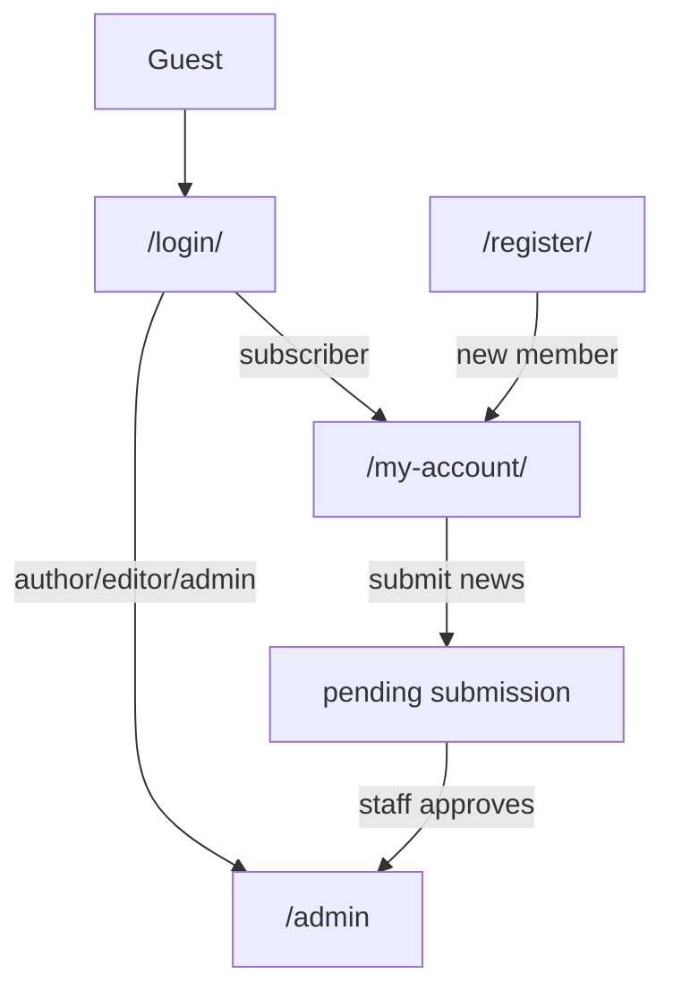

# TNF Today — Complete Build Plan (Master Document)

**Version:** 2.0  
**Date:** 2026-06-06  
**Stack:** Laravel 12 + Filament 4 + Breeze + MySQL + Tailwind + Alpine.js  
**Database:** `tnf_part` (MySQL, XAMPP local)  
**Design reference:** Aaj Tak mobile web (fast, news-first, red masthead, bottom nav)  
**Rule:** WordPress production stays untouched until cutover.

---

## Table of contents

1. [Executive summary](#1-executive-summary)
2. [Current progress tracker](#2-current-progress-tracker)
3. [Architecture overview](#3-architecture-overview)
4. [WordPress module mapping](#4-wordpress-module-mapping)
5. [Build phases (complete breakdown)](#5-build-phases-complete-breakdown)
6. [Database schema (full)](#6-database-schema-full)
7. [User roles, auth & premium](#7-user-roles-auth--premium)
8. [Filament admin specification](#8-filament-admin-specification)
9. [Public frontend specification](#9-public-frontend-specification)
10. [Mobile & Capacitor specification](#10-mobile--capacitor-specification)
11. [REST API specification](#11-rest-api-specification)
12. [PDF / ePaper pipeline](#12-pdf--epaper-pipeline)
13. [OG images & social sharing](#13-og-images--social-sharing)
14. [Push notifications (OneSignal)](#14-push-notifications-onesignal)
15. [Performance requirements](#15-performance-requirements)
16. [Security requirements](#16-security-requirements)
17. [Settings & homepage controls](#17-settings--homepage-controls)
18. [Data migration plan](#18-data-migration-plan)
19. [URL & SEO preservation](#19-url--seo-preservation)
20. [Environment & deployment](#20-environment--deployment)
21. [QA acceptance checklist](#21-qa-acceptance-checklist)
22. [Known gaps to fix](#22-known-gaps-to-fix)
23. [Out of scope (phase 1)](#23-out-of-scope-phase-1)
24. [Sprint calendar](#24-sprint-calendar)
25. [File structure (target)](#25-file-structure-target)
26. [Decisions log](#26-decisions-log)

---

## 1. Executive summary

### Decision

Build a **new Laravel application** in `F:\Rohit Development\tnf part` that replicates and improves TNF Today. Keep WordPress live until DNS cutover. Do not modify production WordPress during development.

### Goals

| Goal | How we achieve it |
|------|-------------------|
| Fast public site | No WP overhead; Redis cache; CDN; full-page cache; eager-loaded queries |
| Modern CMS | Filament 4 — CRUD, moderation queues, settings, mobile-friendly admin |
| Mobile web app feel | Aaj Tak–inspired layout; 360/393/412px tuned; bottom nav; touch targets |
| Long-term control | Single codebase; explicit models; policies; queues; tests |

### What we reuse (unchanged)

| Asset | Change at cutover only |
|-------|------------------------|
| PDF microservice (FastAPI + Redis + S3) | Callback URL + secrets |
| Capacitor Android APK | `server.url` in `capacitor.config.ts` |
| Brand identity | Red `#BC1E38`, Devanagari + Latin fonts |
| Content model | News, videos, ePaper, submissions, categories, tags |

### Effort estimate (1 senior dev)

| Phase | Duration |
|-------|----------|
| Foundation (done) | Week 1 |
| Data layer + roles | Week 2 |
| Filament CMS | Weeks 2–4 |
| Public frontend + auth | Weeks 4–7 |
| ePaper viewer + PDF | Weeks 7–9 |
| API + mobile + perf | Weeks 9–11 |
| Migration + cutover | Week 12 |
| **Total** | **10–12 weeks** |

---

## 2. Current progress tracker

### Completed

| # | Item | Status |
|---|------|--------|
| 1 | Laravel 12 project in main folder | ✅ Done |
| 2 | MySQL database `tnf_part` | ✅ Done |
| 3 | `.env` configured for MySQL | ✅ Done |
| 4 | Base migrations (users, cache, jobs) | ✅ Done |
| 5 | Filament 4 installed | ✅ Done |
| 6 | Admin panel at `/admin` | ✅ Done |
| 7 | TNF brand color on admin (`#BC1E38`) | ✅ Done |
| 8 | Filament admin user created | ✅ Done |
| 9 | Laravel Breeze installed (blade stack) | ✅ Done |
| 10 | Public `/login`, `/register` routes | ✅ Done |

### Not started

Everything from **Phase A** onward in Section 5.

---

## 3. Architecture overview

```
┌─────────────────────────────────────────────────────────────┐
│  Capacitor Android APK (WebView)                             │
│  UA: TNFTodayCapacitor/1.0  →  https://tnftoday.com          │
└────────────────────────────┬────────────────────────────────┘
                             │
┌────────────────────────────▼────────────────────────────────┐
│  Laravel 12 + Filament 4 + Breeze                            │
│  ├── Public: Blade + Alpine.js + Tailwind (mobile-first)     │
│  ├── Admin: Filament /admin                                  │
│  ├── API: /api/v1/                                           │
│  └── Jobs: Redis + Horizon                                   │
└────────────────────────────┬────────────────────────────────┘
                             │
┌────────────────────────────▼────────────────────────────────┐
│  MySQL 8 (tnf_part)                                          │
└────────────────────────────┬────────────────────────────────┘
                             │
┌────────────────────────────▼────────────────────────────────┐
│  S3/MinIO (media, PDFs, OG images)                           │
└────────────────────────────┬────────────────────────────────┘
                             │
┌────────────────────────────▼────────────────────────────────┐
│  PDF Service (FastAPI) → Redis/RQ → S3                       │
│  Callback: POST /api/v1/internal/pdf-job-complete            │
└─────────────────────────────────────────────────────────────┘
```

### Technology stack

| Layer | Technology |
|-------|------------|
| Framework | Laravel 12 |
| Admin | Filament 4 |
| Public auth | Laravel Breeze (Blade) |
| Frontend | Blade + Alpine.js |
| CSS | Tailwind CSS 3.x |
| Queue | Redis + Laravel Horizon |
| Cache | Redis |
| DB | MySQL 8 (`tnf_part`) |
| Storage | S3-compatible (MinIO) |
| Search | DB full-text (phase 1); Meilisearch (phase 2) |
| CDN | Cloudflare |
| PDF | Existing FastAPI service |

---

## 4. WordPress module mapping

Every custom plugin file must have a Laravel equivalent. Nothing skipped.

| WP module | Current file | Laravel equivalent | Build phase |
|-----------|--------------|---------------------|-------------|
| Post types & permalinks | `post-types.php` | Eloquent models + `routes/web.php` | Phase B, G |
| Roles & subscription | `roles.php` | `role` column + Policies + Middleware | Phase C |
| Auth pages | `frontend-auth.php` | Breeze + custom redirects | Phase C, G |
| Workflows (submissions) | `workflows.php` | Filament actions + Events + Mail | Phase E |
| REST API | `rest-api.php` | `routes/api.php` + API controllers | Phase K |
| PDF integration | `pdf-integration.php` | `PdfClient` service + Queue jobs | Phase J |
| Frontend chrome | `frontend-display.php` | Blade components | Phase F |
| ePaper viewer JS | `tnf-epaper-viewer.js` | Port to `resources/js/epaper-viewer.js` | Phase I |
| Mobile app bridge | `mobile-app.php`, `mobile-app-bridge.js` | Middleware + `mobile-bridge.js` | Phase L |
| Social OG images | `social-preview.php` | `OgImageService` + public routes | Phase K |
| Push (OneSignal) | `class-push-notifications.php` | `SendPushNotification` job | Phase K |
| Admin dashboard | `admin-dashboard-stats.php` | Filament widgets | Phase E |
| Admin mobile shell | `admin-mobile.php` | Filament responsive (built-in) | Phase E |
| Header/footer settings | `header-settings.php`, `footer-settings.php` | Filament Settings pages | Phase E |
| Homepage controls | `admin-ui.php` | Filament Settings — **all wired** | Phase E, H |
| Security | `security.php` | Middleware stack | Phase C, M |
| Performance | `performance-home.php` | Cache middleware + CDN | Phase M |
| Legal pages | `legal-pages.php` | Seeders + CMS pages | Phase B, G |

---

## 5. Build phases (complete breakdown)

### Phase 0 — Foundation ✅ COMPLETE

**Deliverables:** Laravel, MySQL, Filament, Breeze, admin user.

---

### Phase A — Core database & models (Week 2)

**Goal:** All content types exist in MySQL with relationships.

#### A.1 Migrations to create

| Migration | Table | Key columns |
|-----------|-------|-------------|
| `extend_users_table` | `users` | `role`, `subscription_active` |
| `create_categories_table` | `categories` | name, slug, description |
| `create_tags_table` | `tags` | name, slug |
| `create_media_table` | `media` | disk, path, mime, size, alt |
| `create_articles_table` | `articles` | title, slug, content, excerpt, author_id, status, embed_url, featured_media_id, published_at, comment_count |
| `create_videos_table` | `videos` | same + embed_url required |
| `create_epaper_editions_table` | `epaper_editions` | pdf_path, restricted, pdf_status, pdf_job_id, pdf_error, pages_json |
| `create_submissions_table` | `submissions` | user_id, status, rejection_reason, promoted_article_id |
| `create_pivot_tables` | pivots | article_category, article_tag, video_category, video_tag |
| `create_settings_table` | `settings` | key (unique), value (JSON) |
| `create_og_images_table` | `og_images` | entity_type, entity_id, path, signature_hash |
| `create_pages_table` | `pages` | title, slug, content (legal/static CMS) |

#### A.2 Eloquent models

- `User`, `Article`, `Video`, `EpaperEdition`, `Submission`
- `Category`, `Tag`, `Media`, `Setting`, `OgImage`, `Page`
- All relationships, casts, scopes (`published`, `trending`, `byCategory`)

#### A.3 Seeders

- **CategorySeeder:** national, health, religion, entertainment, tech, politics, sports, business, exclusive, lifestyle, cultural, crime
- **SettingsSeeder:** all homepage/header/footer defaults
- **PageSeeder:** about-us, contact-us, privacy-policy, terms-of-use
- **DemoSeeder (dev only):** sample articles, videos

#### A.4 Factories

- Article, Video, EpaperEdition, Submission, User (per role)

**Done when:** `php artisan migrate:fresh --seed` creates full schema + 12 categories + settings + legal pages.

---

### Phase B — Roles, policies & auth routing (Week 2)

**Goal:** One login form; role-based redirects; premium logic; members blocked from admin.

#### B.1 Roles

| Role | DB value | After login redirect | Admin access |
|------|----------|---------------------|--------------|
| Guest | — | — | No |
| Member | `subscriber` | `/my-account/` | No |
| Author | `author` | `/admin` | Own content only |
| Editor | `editor` | `/admin` | All content + moderation |
| Admin | `admin` | `/admin` | Full |

#### B.2 Files to create

| File | Purpose |
|------|---------|
| `app/Enums/UserRole.php` | Role enum |
| `app/Services/PremiumAccess.php` | Premium gate logic |
| `app/Policies/ArticlePolicy.php` | CRUD permissions |
| `app/Policies/VideoPolicy.php` | CRUD permissions |
| `app/Policies/EpaperEditionPolicy.php` | CRUD + premium |
| `app/Policies/SubmissionPolicy.php` | Moderation |
| `app/Http/Middleware/EnsureNotSubscriber.php` | Block members from `/admin` |
| `app/Http/Middleware/RedirectIfAuthenticated.php` | Role-based redirect after login |

#### B.3 Premium rules (must match WP exactly)

User has premium if **any** of:
1. Role is `admin`
2. Has `edit_others_posts` capability (editor+)
3. Has `read_premium` permission
4. `subscription_active = true` on user record

Premium gates: restricted ePaper singles + `GET /api/v1/pdfs/{id}/access`.

#### B.4 Auth page customization

| URL | Notes |
|-----|-------|
| `/login/` | Branded TNF; `redirect_to` support |
| `/register/` | Gated by `ALLOW_PUBLIC_REGISTRATION` |
| `/forgot-password/` | Branded |
| `/my-account/` | Member dashboard (Phase G) |

**Done when:** Each role redirects correctly; subscriber gets 403 on `/admin`; premium helper returns correct bool.

---

### Phase C — Filament admin panel (Weeks 3–4)

**Goal:** Full CMS replaces `wp-admin`.

#### C.1 Panel structure

```
/admin
├── Dashboard (KPI widgets)
├── Content
│   ├── News (ArticleResource)
│   ├── Videos (VideoResource)
│   ├── ePaper Editions (EpaperEditionResource)
│   └── Member Submissions (SubmissionResource)
├── Taxonomy
│   ├── Categories
│   └── Tags
├── Users (subscription toggle + role)
├── Media
├── Settings
│   ├── Homepage Controls
│   ├── Header
│   ├── Footer
│   ├── PDF Service
│   ├── Push Notifications (OneSignal)
│   └── Legal / Static Pages
└── System (admin only)
    ├── Cache clear
    └── Health check
```

#### C.2 Resource field specs

**News (ArticleResource)**

| Field | Type | Required |
|-------|------|----------|
| title | TextInput | yes |
| slug | TextInput (auto) | yes, unique |
| content | RichEditor | yes |
| excerpt | Textarea | no |
| featured_image | FileUpload | no |
| author_id | Select | yes |
| categories | MultiSelect | no |
| tags | TagsInput | no |
| embed_url | TextInput | no |
| status | Select | draft/pending/published |

**ePaper (EpaperEditionResource)**

| Field | Type | Notes |
|-------|------|-------|
| pdf_file | FileUpload (PDF only) | Triggers processing job |
| restricted | Toggle | Subscriber-only |
| pdf_status | Badge (read-only) | idle/queued/processing/ready/failed |
| pdf_job_id | Text (read-only) | From PDF service |
| pdf_error | Text (read-only) | On failure |
| pages | JSON (read-only) | Page manifest after ready |

**Video (VideoResource)** — embed_url required.

**Submission (SubmissionResource)**

| Action | Behavior |
|--------|----------|
| Approve & publish | Create published article; link `promoted_article_id` |
| Reject | Set rejected + optional reason + optional email |
| View linked article | Link to ArticleResource |

**User (extended)** — `subscription_active` toggle + role select.

#### C.3 Dashboard widgets

**Org-wide (editor + admin):**
- News published / drafts / pending count
- ePaper published count
- Videos published count
- Categories count
- Featured image % on news
- Pending submissions (alert badge)
- Team performance table (authors + publish count)
- Latest news list
- Quick actions: Add news, Add ePaper, Add video, Review submissions

**Author-scoped:** personal stats only (no org-wide, no team table).

#### C.4 Settings pages (Filament)

All settings stored in `settings` table; cached in Redis.

**Done when:** Staff can CRUD all content types; approve/reject submissions; change settings; dashboard shows correct widgets per role.

---

### Phase D — Design system & Tailwind tokens (Week 4)

**Goal:** Aaj Tak–inspired mobile-first design foundation before building pages.

#### D.1 Design tokens (`tailwind.config.js`)

| Token | Value |
|-------|-------|
| Brand red | `#BC1E38` / `#C41E3A` |
| Dark accent | `#0F1320` |
| Font Latin | Noto Sans |
| Font Devanagari | Noto Sans Devanagari |
| Min touch target | 44×44px |
| Body text min | 14px |
| Breakpoints | 360px, 393px, 412px (custom) |

#### D.2 Reference: Aaj Tak mobile patterns to replicate

- Fixed top bar: hamburger + logo + shortcuts
- Breaking news ticker (marquee)
- Horizontal scroll rails (videos, tags)
- Category blocks (4-card grids)
- Bold red masthead
- Fixed bottom navigation on mobile web
- Fast perceived load (skeleton → content)
- Large tap targets; no horizontal scroll

#### D.3 Base CSS files

| File | Purpose |
|------|---------|
| `resources/css/app.css` | Tailwind + global tokens |
| `resources/css/components/header.css` | Masthead, ticker, drawer |
| `resources/css/components/cards.css` | News, video, ePaper cards |
| `resources/css/components/mobile-nav.css` | Bottom nav, safe areas |
| `resources/css/auth.css` | Auth-lite pages only |

**Done when:** Design tokens documented; fonts load; red masthead renders at 360px without overflow.

---

### Phase E — Public layout & chrome (Week 5)

**Goal:** Shared shell on every public page.

#### E.1 Blade components

| Component | Used on |
|-----------|---------|
| `<x-site.layout>` | Base wrapper |
| `<x-site.header>` | All pages (auth-lite variant) |
| `<x-site.footer>` | All pages |
| `<x-site.breaking-ticker>` | Header |
| `<x-site.drawer>` | Side category drawer |
| `<x-site.topic-pills>` | Top 14 hot tags (hidden in app) |
| `<x-site.whatsapp-bar>` | Optional promo |
| `<x-site.masthead-banner>` | From header settings |
| `<x-cards.news-card>` | Grids, rails |
| `<x-cards.video-card>` | Video rail, archive |
| `<x-cards.epaper-card>` | ePaper archive, teaser |
| `<x-site.share-bar>` | News single, ePaper |
| `<x-site.web-bottom-nav>` | Mobile web only |
| `<x-site.app-bottom-nav>` | Capacitor only |
| `<x-site.page-loader>` | App mode |
| `<x-site.breadcrumbs>` | Singles |

#### E.2 Header structure

1. Top bar: hamburger, logo, nav, e-Paper shortcut, Sign In / My Account
2. Breaking news ticker (count from settings, default 12)
3. Side drawer (4 groups — see Section 9)
4. Topic pills (top 14 tags; hidden in Capacitor)
5. Optional WhatsApp promo bar
6. Optional masthead banner

#### E.3 Footer structure

1. Disclaimer block (text + contact email from settings)
2. Copyright + credits line
3. Footer nav: Videos, ePaper, About, Contact, Terms, Privacy
4. Back-to-top button

#### E.4 Auth-lite mode

On `/login/`, `/register/`, `/forgot-password/`, `/my-account/`: hide ticker and topic pills; minimal chrome.

#### E.5 Primary nav (desktop)

Home → ePaper → National → Entertainment → Religion → Lifestyle → Sports → **More** (drawer)

**Done when:** Header/footer render on all pages; settings drive banner/disclaimer; drawer opens; mobile bottom nav shows at ≤768px.

---

### Phase F — Homepage (Week 5–6)

**Goal:** Full homepage; **every admin setting must affect live output** (fix WP gap).

#### F.1 Main column sections

| Section | CSS class | Default count | Setting key |
|---------|-----------|---------------|-------------|
| Hero | `.tnf-hero-section` | 1 lead + 5 headlines | `top_stories_count` |
| Featured videos | `.tnf-featured-videos` | 10 | `featured_videos_count`, `show_featured_videos` |
| ePaper teaser | `.tnf-epaper-teaser` | static CTA | — |
| Category rails | `.tnf-cat-block` | 4 cards each | `show_crime` etc. |
| Recent news | `.tnf-recent-news` | 9 | `recent_news_count` |

**Category rail order:** Health, Religion, Politics, Sports, Business, Entertainment, Tech, Exclusive, Lifestyle, Cultural, Crime News. (National = nav only, not homepage rail — confirm in Decisions log.)

#### F.2 Sidebar

| Section | Order by | Default | Setting |
|---------|----------|---------|---------|
| Trending | comment_count DESC | 8 | `trending_count`, `show_trending` |
| Top news | published_at DESC | 6 | `top_stories_count` |

#### F.3 Controller

`HomeController` — single action; eager-load all sections; no N+1; cache full HTML for anonymous users (Redis, 5 min TTL).

#### F.4 Asset loading

- `home.js` — home page only
- Do NOT load ePaper viewer globally

**Done when:** Changing any homepage setting in Filament immediately changes live homepage.

---

### Phase G — Archives, singles & static pages (Week 6–7)

**Goal:** All content pages except ePaper viewer.

#### G.1 Routes

```php
Route::get('/', HomeController::class);
Route::get('/category/{category:slug}', CategoryController::class);
Route::get('/tag/{tag:slug}', TagController::class);
Route::get('/videos', VideoArchiveController::class);
Route::get('/videos/{video:slug}', VideoSingleController::class);
Route::get('/epaper', EpaperArchiveController::class);
Route::get('/epaper/{edition:slug}', EpaperSingleController::class);
Route::get('/search', SearchController::class);
Route::get('/about-us', PageController::class);
Route::get('/contact-us', PageController::class);
Route::get('/privacy-policy', PageController::class);
Route::get('/terms-of-use', PageController::class);
Route::get('/my-account', AccountController::class)->middleware('auth');
Route::get('/{article:slug}', ArticleSingleController::class); // LAST
```

#### G.2 Page inventory (18 pages — all required)

| # | Page | URL |
|---|------|-----|
| 1 | Home | `/` |
| 2 | Category archive | `/category/{slug}/` |
| 3 | Tag archive | `/tag/{slug}/` |
| 4 | News single | `/{slug}/` |
| 5 | Video archive | `/videos/` |
| 6 | Video single | `/videos/{slug}/` |
| 7 | ePaper archive | `/epaper/` |
| 8 | ePaper single | `/epaper/{slug}/` |
| 9 | Search | `/search?q=` |
| 10 | 404 | any invalid |
| 11 | Login | `/login/` |
| 12 | Register | `/register/` |
| 13 | Forgot password | `/forgot-password/` |
| 14 | My Account | `/my-account/` |
| 15 | About Us | `/about-us/` |
| 16 | Contact Us | `/contact-us/` |
| 17 | Privacy Policy | `/privacy-policy/` |
| 18 | Terms of Use | `/terms-of-use/` |

#### G.3 News single partials

- Category breadcrumb / meta line
- Author byline + date
- Social share dock (FB, WA, LI, X, copy, native share)
- Related articles (same category, 4 cards)
- Optional YouTube embed from `embed_url`

#### G.4 Share bar (news + ePaper)

Networks: Facebook, WhatsApp, LinkedIn, X, Copy link, Native share (mobile).

**Done when:** All 18 page types render; share bar works; search returns results; 404 branded.

---

### Phase H — My Account & submission workflow (Week 7)

**Goal:** Member dashboard + front-end news submission + moderation pipeline.

#### H.1 My Account page (`/my-account/`)

| Feature | Detail |
|---------|--------|
| Profile summary | Display name, email, role label |
| Subscription badge | Active / Inactive |
| KPI cards | Total, Live on site, Article removed, Pending, Rejected |
| Submit news form | Title, rich text, image ≤5MB (jpeg/png/webp/gif), optional video URL |
| Own submissions list | Status badges |
| Withdraw | Allowed: pending, draft, rejected, or approved without live article |
| Logout | Link |
| Premium gate copy | When restricted ePaper blocked |

#### H.2 Submission state machine

```
Member submit → pending
pending → approved (private) → creates published article
pending → rejected (draft)
Special: "Article removed" — approved but linked article deleted
```

#### H.3 Approve action (Filament)

1. Create published `Article` from submission data
2. Copy title, content, thumbnail, embed_url
3. Set submission `approved`
4. Link `promoted_article_id`
5. Optional: email member

#### H.4 Reject action

1. Set `rejected`
2. Optional `rejection_reason`
3. Optional email to member

#### H.5 Notifications

- Email admin on new submission
- Optional email member on approve/reject

**Done when:** Full submission lifecycle works end-to-end.

---

### Phase I — ePaper public viewer (Weeks 8–9)

**Goal:** Port `tnf-epaper-viewer.js` — highest-risk frontend piece.

#### I.1 Features (all required — port from WP)

| Feature | Priority |
|---------|----------|
| Page thumbnails (sidebar desktop / horizontal scroll mobile) | P0 |
| Main page view (PNG from manifest) | P0 |
| Page select dropdown | P0 |
| Number pager (window of 5) | P0 |
| Prev / next (desktop toolbar + mobile bottom bar) | P0 |
| Zoom in / out / reset | P0 |
| Clip tool (drag region → share modal) | P1 |
| Clip URL params `?tnf_clip=1&tnf_pg&tnf_cx&tnf_cy&tnf_cw&tnf_ch` | P1 |
| Clip-only standalone page with brand banner | P1 |
| Share dock | P0 |
| Deep link `?tnf_pg=N` (history API) | P1 |
| Mobile breakpoints 360/393/412px | P0 |
| Premium gate | P0 |
| PDF.js fallback if manifest empty | P1 |

#### I.2 Files

| File | Notes |
|------|-------|
| `resources/js/epaper-viewer.js` | Port from WP |
| `resources/css/epaper-viewer.css` | Port from `frontend-pdf-report.css` |
| `resources/views/epaper/show.blade.php` | Viewer shell |

#### I.3 Premium gate behavior

| User | Restricted ePaper |
|------|-------------------|
| Guest | Redirect to `/login/` |
| Logged-in non-subscriber | Show premium message + link to `/my-account/` |
| Subscriber / editor / admin | Full access |

#### I.4 Asset rule

Load `epaper-viewer.js` + CSS **only** on ePaper single page. Never globally.

**Done when:** Full edition viewable; clip share works; premium gate correct; passes 360/393/412 QA.

---

### Phase J — PDF backend integration (Week 8)

**Goal:** Laravel ↔ existing FastAPI PDF service.

#### J.1 Job flow

```
Admin uploads PDF in Filament
  → Store on S3/local
  → Dispatch EnqueuePdfRenderJob
  → POST {PDF_SERVICE_URL}/pdf/process
      Body: { source_url, external_id: "edition-{id}", idempotency_key }
  → Update epaper_editions.pdf_status = queued
  ← Callback POST /api/v1/internal/pdf-job-complete
  → Store pages_json, featured from page 1, status = ready
  → Dispatch GenerateOgImageJob
```

#### J.2 Files

| File | Purpose |
|------|---------|
| `app/Services/PdfClient.php` | HTTP client to FastAPI |
| `app/Jobs/EnqueuePdfRenderJob.php` | Trigger processing |
| `app/Http/Controllers/Api/V1/PdfCallbackController.php` | Worker callback |
| `app/Http/Middleware/VerifyPdfCallbackSecret.php` | Secret header check |

#### J.3 PDF service `.env` change (at integration test)

```env
WORDPRESS_CALLBACK_URL=https://your-domain/api/v1/internal/pdf-job-complete
WP_CALLBACK_SECRET=matching_secret
```

#### J.4 pdf_status values

`idle` → `queued` → `processing` → `ready` | `failed`

**Done when:** Upload in admin → processing → ready; page 1 becomes featured image; failure shows error in admin.

---

### Phase K — REST API, OG images & push (Week 10)

**Goal:** API parity + social/SEO + notifications.

#### K.1 API endpoints (`/api/v1/`)

| Method | Route | Auth | Purpose |
|--------|-------|------|---------|
| GET | `/news` | public | Paginated list |
| GET | `/news/{id}` | public | Single |
| GET | `/pdfs` | public | ePaper list |
| GET | `/pdfs/{id}` | public | ePaper meta |
| GET | `/pdfs/{id}/access` | auth | Premium gate + pages + pdf URL |
| GET | `/videos` | public | Video list |
| POST | `/submissions` | auth + permission | Create submission |
| GET | `/submissions/mine` | auth | Own submissions |
| POST | `/submissions/{id}/approve` | moderator | Approve |
| POST | `/submissions/{id}/reject` | moderator | Reject |
| POST | `/internal/pdf-job-complete` | secret header | PDF callback |
| GET | `/pdf-report/{id}/page-og` | public | JPEG OG page 1 |
| GET | `/pdf-report/{id}/clip-og` | public signed | JPEG clip OG |

#### K.2 JSON shape (keep WP-compatible)

```json
{
  "id": 123,
  "title": "...",
  "excerpt": "...",
  "content": "<p>HTML</p>",
  "date": "2026-01-01 12:00:00",
  "slug": "article-slug",
  "author_id": 1,
  "featured": "https://cdn.../image.jpg"
}
```

#### K.3 OG image system

| Feature | Requirement |
|---------|-------------|
| Persisted JPEG | ~1200×630, <300KB, disk/CDN |
| Never expose `/api/` in `og:image` | Public `/og/...` routes |
| PDF page 1 OG | Dedicated endpoint |
| Clip OG | HMAC-signed bbox, 90-day TTL, 40 req/min/IP |
| Prewarm on publish | `GenerateOgImageJob` queue |

#### K.4 Push (OneSignal)

Trigger on publish: news, ePaper, video.  
Payload: title, excerpt, deep link URL.

**Done when:** All API endpoints return correct shapes; OG images serve; push fires when keys configured.

---

### Phase L — Mobile app bridge & Capacitor compatibility (Week 10–11)

**Goal:** Android WebView app works identically against new site.

#### L.1 App detection

| Signal | Use |
|--------|-----|
| UA contains `TNFTodayCapacitor` | Production app |
| Query `?tnf_app=1` + cookie | QA preview in browser |

#### L.2 App-only UI

| Feature | Implementation |
|---------|----------------|
| Bottom tab bar | Home, ePaper, Videos, Menu, Account |
| Page loader | Logo + spinner between navigations |
| Pull-to-refresh | Home page |
| Offline overlay | Retry button |
| Haptic feedback | On nav tap |
| Hide topic pills | In app shell |
| Hide web bottom nav | Replaced by app tabs |
| Block `/admin` in WebView | Redirect to account + CMS hint |
| Editorial hub links | Open in Capacitor Browser plugin |
| Preserve `?tnf_app=1` | On internal links (QA) |
| Safe area insets | `viewport-fit=cover` |

#### L.3 Files

| File | Purpose |
|------|---------|
| `app/Http/Middleware/DetectCapacitorApp.php` | UA + cookie detection |
| `resources/js/mobile-bridge.js` | Port from WP |
| `resources/views/components/site/app-bottom-nav.blade.php` | Tab bar |

#### L.4 Capacitor config change (at cutover)

```typescript
// mobile-app/capacitor.config.ts
server: { url: 'https://tnftoday.com' }
```

**Done when:** Real Android device QA passes; all app-only features work.

---

### Phase M — Performance, security & caching (Week 11)

**Goal:** Hit performance targets; harden security.

#### M.1 Performance targets

| Metric | Target |
|--------|--------|
| TTFB (cached homepage) | < 200ms |
| LCP (mobile) | < 2.5s |
| CLS | < 0.1 |
| Homepage HTML weight | < 100KB |

#### M.2 Optimizations checklist

- [ ] Full-page cache (Redis) for anonymous users
- [ ] Redis object cache for settings + queries
- [ ] CDN for static assets and OG images
- [ ] WebP/AVIF with responsive `srcset`
- [ ] Lazy load below-fold images
- [ ] Defer non-critical JS
- [ ] Self-host or async-load fonts (Noto Sans + Devanagari)
- [ ] Eager-load homepage (single controller, no N+1)
- [ ] HTTP/2 + Brotli
- [ ] Route-level cache headers middleware

#### M.3 Security checklist

- [ ] HTTPS + HSTS (production)
- [ ] CSRF on all forms
- [ ] Rate limiting: login, OG endpoints, API
- [ ] HMAC-signed clip URLs with expiry
- [ ] Secret header on PDF callback (`X-Callback-Secret`)
- [ ] Secret header on PDF service requests
- [ ] Members blocked from `/admin`
- [ ] Capacitor blocks admin in WebView
- [ ] Content-Security-Policy (tuned for YouTube)
- [ ] File upload validation (type, size)
- [ ] No secrets in Git

**Done when:** Lighthouse mobile LCP < 2.5s on 4G; security checklist 100%.

---

### Phase N — Data migration & cutover (Week 12)

**Goal:** Zero SEO loss; production data in Laravel.

#### N.1 Export from WordPress

| WP source | Laravel target |
|-----------|----------------|
| `wp_users` + `wp_usermeta` | `users` |
| `wp_posts` (tnf_news + post) | `articles` |
| `wp_posts` (tnf_video) | `videos` |
| `wp_posts` (tnf_pdf_report) | `epaper_editions` |
| `wp_posts` (tnf_user_submission) | `submissions` |
| `wp_terms` | `categories`, `tags` |
| `wp_postmeta` (tnf_*) | column mapping |
| `wp_options` (tnf_*) | `settings` |
| Media attachments | S3 + `media` table |

#### N.2 Import command

```bash
php artisan tnf:import-wordpress {sql_dump}
```

- Preserve IDs where possible (redirect mapping)
- Preserve slugs exactly
- Map `tnf_subscription_active` → `subscription_active`
- Map `tnf_promoted_news_id` → `promoted_article_id`

#### N.3 Validation

- Row counts match
- Spot-check 10 articles, 5 ePapers, all users
- All URLs return 200
- Regenerate all OG images

#### N.4 Cutover steps

1. Final data sync
2. Full QA (Section 21)
3. DNS cutover
4. Update Capacitor `server.url`
5. Update PDF service callback URL
6. Monitor 48 hours
7. Submit sitemap to Google Search Console

**Done when:** Production live on Laravel; all QA passed; 48h stable.

---

## 6. Database schema (full)

### `users` (extended)

| Column | Type | Notes |
|--------|------|-------|
| id | bigint | PK |
| name | varchar | |
| email | varchar | unique |
| password | varchar | |
| role | enum | subscriber, author, editor, admin |
| subscription_active | boolean | default false |
| email_verified_at | timestamp | nullable |
| created_at / updated_at | timestamps | |

### `articles`

| Column | Type | Notes |
|--------|------|-------|
| id | bigint | PK |
| title | varchar | |
| slug | varchar | unique, root URL `/{slug}/` |
| content | longtext | HTML |
| excerpt | text | nullable |
| author_id | FK users | |
| status | enum | draft, pending, published |
| embed_url | varchar | nullable |
| featured_media_id | FK media | nullable |
| comment_count | int | default 0, for trending |
| published_at | timestamp | nullable |
| created_at / updated_at | timestamps | |

**Indexes:** `slug` UNIQUE; `(status, published_at)`

### `videos`

Same as articles + `embed_url` NOT NULL.

### `epaper_editions`

| Column | Type | Notes |
|--------|------|-------|
| pdf_path | varchar | S3 path |
| restricted | boolean | default false |
| pdf_status | enum | idle, queued, processing, ready, failed |
| pdf_job_id | varchar | nullable |
| pdf_error | text | nullable |
| pages_json | json | nullable, page manifest |

**Indexes:** `slug` UNIQUE; `pdf_status`

### `submissions`

| Column | Type | Notes |
|--------|------|-------|
| user_id | FK users | |
| status | enum | pending, approved, rejected |
| rejection_reason | text | nullable |
| promoted_article_id | FK articles | nullable |

### `categories` / `tags`

| Column | Type |
|--------|------|
| id | bigint |
| name | varchar |
| slug | varchar unique |
| description | text nullable |

### Pivot tables

- `article_category`, `article_tag`
- `video_category`, `video_tag`

### `media`

| Column | Type |
|--------|------|
| disk | varchar |
| path | varchar |
| mime | varchar |
| size | int |
| alt | varchar nullable |

### `settings`

| Column | Type |
|--------|------|
| key | varchar unique |
| value | json |

### `og_images`

| Column | Type |
|--------|------|
| entity_type | varchar |
| entity_id | bigint |
| path | varchar |
| signature_hash | varchar nullable |

### `pages` (legal/static CMS)

| Column | Type |
|--------|------|
| title | varchar |
| slug | varchar unique |
| content | longtext |

---

## 7. User roles, auth & premium

### Auth flow



### Filament permissions

| Permission | Roles |
|------------|-------|
| `view_admin_panel` | author, editor, admin |
| `manage_news` | author (own), editor (all), admin |
| `manage_videos` | same |
| `manage_epaper` | same |
| `moderate_submissions` | editor, admin |
| `manage_settings` | admin |
| `manage_users` | admin |
| `read_premium` | subscriber+, editors, admin |

### UI labels (product-facing)

| DB role | UI label |
|---------|----------|
| subscriber | Member |
| author | Contributor |
| editor | Editor |
| admin | Administrator |

---

## 8. Filament admin specification

See Phase C for full detail. Key rules:

- Filament replaces `wp-admin` entirely
- Members (`subscriber`) must never access `/admin`
- Author dashboard = personal stats only
- Editor/admin dashboard = org-wide stats + team table
- All homepage settings must wire to live site (fix WP gap)
- Mobile admin: Filament responsive (replaces `admin-mobile.php`)

---

## 9. Public frontend specification

### Editorial categories (auto-seeded)

`national`, `health`, `religion`, `entertainment`, `tech`, `politics`, `sports`, `business`, `exclusive`, `lifestyle`, `cultural`, `crime`

### Drawer groups

| Group | Links |
|-------|-------|
| Start here | Home |
| Daily digest | National, Health, Religion, Entertainment |
| Desk & arena | Tech, Politics, Sports, Business |
| Magazine | Exclusive, Lifestyle, Cultural, Crime |

### Asset loading rules

| Asset | Load on |
|-------|---------|
| `app.css` | All pages |
| `home.js` | Home only |
| `epaper-viewer.js` + CSS | ePaper single only |
| `mobile-bridge.js` | App detection only |
| `auth.css` | Auth pages only |

---

## 10. Mobile & Capacitor specification

### Mandatory QA viewports

| Device | Width × height |
|--------|----------------|
| Android small | 360 × 640 |
| Android medium | 393 × 851 |
| Android large | 412 × 915 |

### Mobile requirements checklist

- [ ] No horizontal scroll on any page
- [ ] Touch targets ≥ 44×44px
- [ ] Body text ≥ 14px
- [ ] Safe area padding (`env(safe-area-inset-*)`)
- [ ] Fixed bottom nav does not cover content
- [ ] ePaper toolbar sticky without clipping
- [ ] Auth forms usable with on-screen keyboard
- [ ] Capacitor: tab bar + loader + offline state
- [ ] Pull-to-refresh on app home

### Capacitor plugins in use

`App`, `Browser`, `Camera`, `Filesystem`, `Haptics`, `Keyboard`, `Network`, `Preferences`, `PushNotifications`, `SplashScreen`, `StatusBar`

---

## 11. REST API specification

Base: `/api/v1/`  
Transition compatibility (optional): `/wp-json/tnf/v1/` redirect layer.

See Phase K for full endpoint table.

---

## 12. PDF / ePaper pipeline

Keep existing FastAPI service. Change only callback URL and secrets.

See Phase J for job flow.

---

## 13. OG images & social sharing

See Phase K.3. Never expose `/api/` URLs in `og:image` meta tags.

---

## 14. Push notifications (OneSignal)

| Config key | Source |
|------------|--------|
| `ONESIGNAL_APP_ID` | `.env` + Filament settings |
| `ONESIGNAL_REST_KEY` | `.env` + Filament settings |
| `FRONTEND_URL` | `.env` |

Note: OneSignal (server) vs Firebase (app) are separate. Push disabled in app until Firebase configured. Document in phase 2.

---

## 15. Performance requirements

See Phase M.1 and M.2.

---

## 16. Security requirements

See Phase M.3.

---

## 17. Settings & homepage controls

**All must be wired to live site (rebuild fixes WP gap).**

| Setting key | Default | Controls |
|-------------|---------|----------|
| `breaking_count` | 12 | Breaking ticker headline count |
| `top_stories_count` | 6 | Hero sidebar + top news |
| `featured_videos_count` | 8 | Featured videos rail |
| `recent_news_count` | 10 | Recent news grid |
| `trending_count` | 8 | Sidebar trending |
| `show_featured_videos` | true | Show/hide videos rail |
| `show_trending` | true | Show/hide trending sidebar |
| `show_weather` | true | **Decision needed:** implement or remove |
| `show_crime` | true | Show/hide crime category rail |

### Header settings

- `banner_image`, `banner_link_url`

### Footer settings

- `disclaimer_text`, `disclaimer_email`, `credits_line`

### PDF service settings

- `service_url`, `service_secret`

---

## 18. Data migration plan

See Phase N.

---

## 19. URL & SEO preservation

### Must preserve (301 if path changes)

| Pattern | Notes |
|---------|-------|
| `/{slug}/` | News root permalinks |
| `/epaper/{slug}/` | ePaper singles |
| `/videos/{slug}/` | Video singles |
| `/category/{slug}/` | Category archives |
| `/tag/{slug}/` | Tag archives |
| `/login/`, `/register/`, `/my-account/` | Auth |
| `/about-us/`, `/contact-us/`, etc. | Legal |
| Legacy `/tnf_news/{slug}/` | 301 → `/{slug}/` |

### SEO tasks at cutover

- Migrate meta titles/descriptions
- Regenerate OG images
- Submit new sitemap
- Keep Google Search Console property

---

## 20. Environment & deployment

### Laravel `.env` (complete)

```env
APP_NAME="TNF Today"
APP_URL=https://tnftoday.com

DB_CONNECTION=mysql
DB_HOST=127.0.0.1
DB_PORT=3306
DB_DATABASE=tnf_part
DB_USERNAME=root
DB_PASSWORD=

CACHE_STORE=redis
QUEUE_CONNECTION=redis
SESSION_DRIVER=redis
REDIS_HOST=127.0.0.1
REDIS_PORT=6379

FILESYSTEM_DISK=s3
AWS_ACCESS_KEY_ID=
AWS_SECRET_ACCESS_KEY=
AWS_BUCKET=
AWS_ENDPOINT=

PDF_SERVICE_URL=
PDF_SERVICE_SECRET=
PDF_CALLBACK_SECRET=

EPAPER_CLIP_OG_SECRET=
ONESIGNAL_APP_ID=
ONESIGNAL_REST_KEY=
FRONTEND_URL=

ALLOW_PUBLIC_REGISTRATION=true
```

### Deployment topology

```
Cloudflare CDN
  → nginx
    → Laravel (PHP-FPM)
    → Redis
    → MySQL
    → S3
    → pdf-service (FastAPI + worker)
```

---

## 21. QA acceptance checklist

### Public site
- [ ] Header: logo, nav, breaking ticker, drawer
- [ ] Homepage: hero, videos, category rails, sidebar, ePaper teaser
- [ ] All 12 category archives load
- [ ] News single: share bar, related, embed
- [ ] Video single: player, related
- [ ] ePaper archive + single viewer (all features)
- [ ] Search returns results
- [ ] Footer + legal links
- [ ] 404 page

### Auth
- [ ] Login / register / forgot password
- [ ] Guest blocked from `/my-account/`
- [ ] Member sees account + can submit news
- [ ] Member blocked from `/admin`
- [ ] Editor lands in Filament after login

### Premium
- [ ] Free ePaper opens for guest
- [ ] Restricted ePaper → login for guest
- [ ] Restricted ePaper → account message for non-subscriber
- [ ] Subscriber sees restricted content

### Admin
- [ ] Create news, video, ePaper
- [ ] PDF upload → processing → ready
- [ ] Approve/reject submission
- [ ] Homepage/header/footer settings reflect on site
- [ ] User premium toggle works

### API
- [ ] All `/api/v1/` endpoints return expected shapes
- [ ] PDF callback updates edition
- [ ] OG endpoints return JPEG

### Mobile
- [ ] Browser mobile: bottom nav, drawer, no overflow at 360/393/412
- [ ] Capacitor app: tab bar, loader, account, ePaper usable
- [ ] Editor hub opens CMS in browser
- [ ] Pull-to-refresh on app home

### Performance
- [ ] Homepage LCP < 2.5s on 4G (mobile)
- [ ] Cached TTFB < 200ms

---

## 22. Known gaps to fix

| Gap in current WP | Fix in Laravel |
|-------------------|----------------|
| Homepage settings not wired | All settings drive homepage queries |
| Weather widget setting exists but no UI | Implement or remove setting |
| Push disabled (no Firebase) | Document; enable when ready |
| OneSignal vs Firebase separate | Unify push strategy in phase 2 |
| No payment for premium | Manual toggle phase 1; billing phase 2 |
| `post` type mixed with `tnf_news` | Migrate both into `articles` |
| National category not on homepage | Decide: add rail or nav-only |

---

## 23. Out of scope (phase 1)

- Payment gateway (Razorpay/Stripe)
- iOS Capacitor app
- Native non-WebView screens
- Meilisearch / advanced search
- Multi-language (i18n)
- Comments system (unless required)
- WordPress block editor compatibility
- Running WordPress and Laravel in parallel long-term

---

## 24. Sprint calendar

| Sprint | Weeks | Phases | Deliverable |
|--------|-------|--------|-------------|
| S0 | 1 | Phase 0 | ✅ Laravel + MySQL + Filament + Breeze |
| S1 | 2 | A + B | Full schema + roles + policies |
| S2 | 3 | C | Filament resources + settings |
| S3 | 4 | D + E | Design system + public chrome |
| S4 | 5 | F | Homepage (all settings wired) |
| S5 | 6 | G | Archives + singles + static pages |
| S6 | 7 | H | My Account + submission workflow |
| S7 | 8 | J | PDF backend integration |
| S8 | 9 | I | ePaper viewer (full port) |
| S9 | 10 | K | API + OG + push |
| S10 | 11 | L + M | Mobile bridge + performance + security |
| S11 | 12 | N | Migration + cutover + QA |

---

## 25. File structure (target)

```
tnf part/
├── app/
│   ├── Enums/UserRole.php
│   ├── Filament/
│   │   ├── Resources/        (Article, Video, Epaper, Submission, User, Category, Tag)
│   │   ├── Pages/Settings/   (Homepage, Header, Footer, Pdf, Push, Legal)
│   │   └── Widgets/          (Dashboard KPIs)
│   ├── Http/
│   │   ├── Controllers/Web/  (Home, Category, Tag, Article, Video, Epaper, Search, Account, Page)
│   │   ├── Controllers/Api/V1/
│   │   └── Middleware/       (DetectCapacitorApp, EnsureNotSubscriber, VerifyPdfCallbackSecret)
│   ├── Jobs/                 (EnqueuePdfRender, GenerateOgImage, SendPush)
│   ├── Models/
│   ├── Policies/
│   └── Services/             (PremiumAccess, PdfClient, OgImageService, ClipSignature)
├── resources/
│   ├── css/                  (app, auth, epaper-viewer, components/)
│   ├── js/                   (home, epaper-viewer, mobile-bridge)
│   └── views/
│       ├── components/site/  (header, footer, share-bar, bottom-nav, etc.)
│       ├── components/cards/
│       ├── pages/            (home, singles, archives, auth, account)
│       └── layouts/
├── routes/web.php
├── routes/api.php
├── database/migrations/
├── database/seeders/
└── docs/TNF-BUILD-PLAN.md    (this file)
```

---

## 26. Decisions log

| # | Decision | Options | Status |
|---|----------|---------|--------|
| 1 | National category on homepage | Add rail / Nav only (current WP) | **Pending** |
| 2 | Weather widget setting | Implement widget / Remove toggle | **Pending** |
| 3 | Panel path | `/admin` | ✅ Decided |
| 4 | Database name | `tnf_part` | ✅ Decided |
| 5 | Laravel version | 12 (not 11 as original spec) | ✅ Decided |
| 6 | Filament version | 4 (not 3 as original spec) | ✅ Decided |
| 7 | Frontend interactivity | Alpine.js (not Livewire for public) | ✅ Decided |
| 8 | Payment for premium | Manual toggle phase 1 | ✅ Decided |

---

## Next immediate step

**Phase A — Core database & models**

We will create all migrations, models, seeders, and run `migrate:fresh --seed`.

Reply **"start Phase A"** when ready and we will do it step by step (one command at a time, as you prefer).

---

*This document is the single source of truth for the TNF Today rebuild. Update version on any scope change.*
